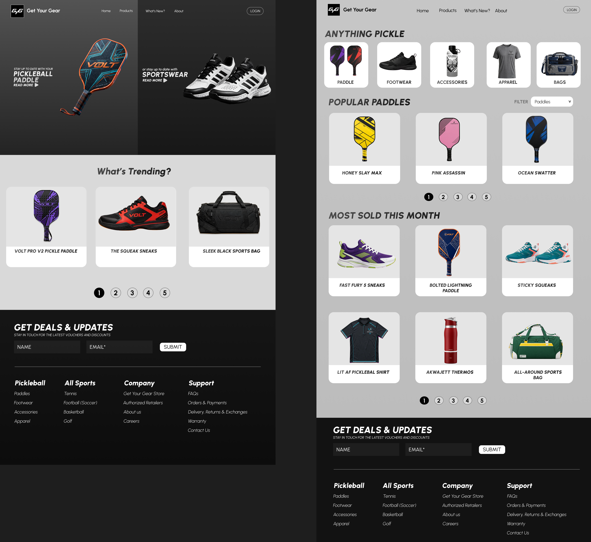
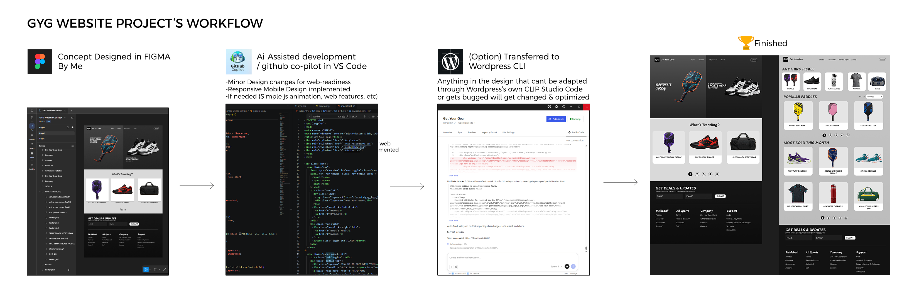

## Preview

## Get Your Gear: From Design Concept to Web Development
**Get Your Gear** is a sports and pickleball-focused e-commerce website showcasing a modern, responsive front-end experience. The project was designed in Figma and developed with the assistance of GitHub Copilot to transform the design into a functional web prototype. It features a home landing page and a products page.

- **Website Source Files:** Available in the website branch.
- Live Demo (GitHub Pages): https://27iyann.github.io/gyg-website-concept/

## About the Developer
I am a Graphic Designer who leverages AI tools like GitHub Copilot to streamline web development and transform design concepts into functional, interactive prototypes.

My development workflow is AI-assisted, using prompts to generate and iterate on code time efficiently. Rather than writing every line manually, I guide the AI through multiple iterations and manually intervene when needed to troubleshoot issues, refine functionality, modify the generated code, and ensure the final implementation aligns with the intended design. This approach allows me to combine my design concepts with AI-assisted development to create and build prototypes.

[https://iananderson27.my.canva.site/portfolio](https://iananderson27.my.canva.site/portfolio)

## Project notes
- Designed by hand in FIGMA
- For this project, image generation was used for product images using Meta.ai
- AI-assisted development /w Microsoft GitHub Copilot using VSCODE
- HTML, CSS, and JS are used
- Website is responsive for Mobile

